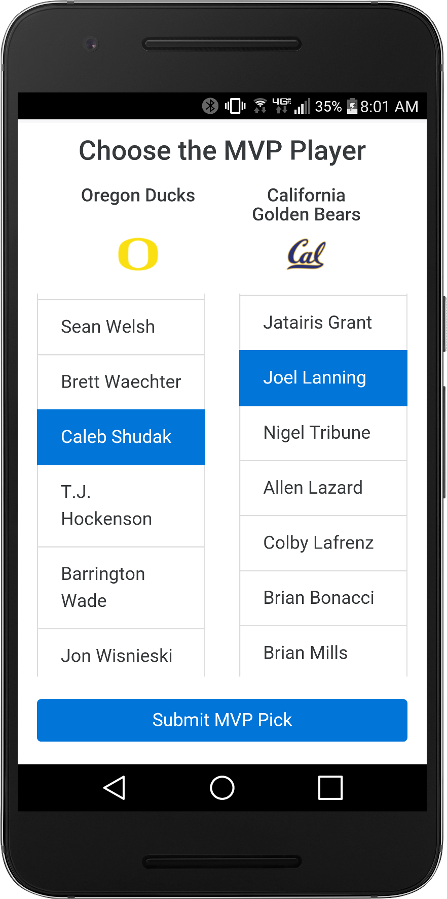
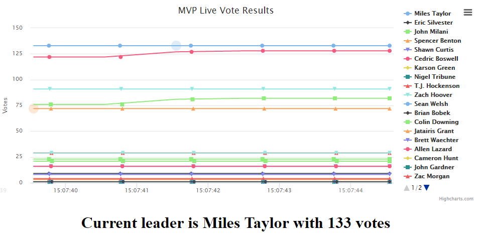

# Hype!

## Table of Contents

- [What is Hype?](##what-is-hype)
- [How can I get Hype?](#how-can-i-get-hype)
- [Inspiration](#inspiration)
- [What it does](#what-it-does)
- [How we built it](#how-we-built-it)
- [Challenges we ran into](#challenges-we-ran-into)
- [Accomplishments that we're proud of](#accomplishments-that-were-proud-of)
- [What we learned](#what-we-learned)
- [What's next for Hyped!](#whats-next-for-hyped!)
- [Built With](#built-with)

###What is Hype?
Well I'm hyped already. Aren't you? Hype is a multiplatform responsive web app that its main goal is to create excitement and engagement toward an audience of sport enthusiasms. Allows them to get involved in small polls and raffles in the live game they are in now. Users will have access to the poll results as soon as they vote represented by material design charts.

###How can I get Hype?
Awesome! Glad you want to try our product. Right now Hype! is a responsive web app so it's available through any browser or your phone browser. Don't worry. It's a responsive design so it will look as good as a native app. We are however are developing hype for Android and iOS natively as well.

  
  
  
<b>Hype! being run on a browser</b>

  

###Inspiration
We feel the pain that the sports community and its engagement is declining. About half of the population rather watch their games from the comfort of their home than get the fun and physical experience of live sporting events. As sports biggest fan we will have none of it!

###What it does
Our app focuses on fan engagement and revenue. We like to keep the game fun. We also like to keep it interactive. Our app allows the management of polling your stadium fans (Who was the MVP this game? How well do you know Portland Blazers?, etc.) or run raffles to raise money for a charity, organization or both!

###How we built it
Consistency was our number #1 goal. This is why we went with a full stack mobile web app that would have the same robust and UI feel regardless of where and when you access it. We used various technologies to make this idea into a reality. Nodejs, SQL, Javascript, CSS, HTML, Xamarin, Android, iOS, and honestly the list will go on.

###Challenges we ran into
Most of us were absolute beginners to lots of the technologies we covered in this hackathon. We never got uncomfortable with the idea and used it as an opportunity to learn something fun and new. We reached lots of dead ends, lots of head banging, and hair pulling, but we pushed on into creating our complete and working full stack app.

###Accomplishments that we're proud of
We made something awesome! Is it a full complete working application that can now be used by millions of users? No. We needed 20 more minutes for that.

###What we learned
Lots! We loved the idea of using technologies we never even heard or were familiar with.

###What's next for Hyped!
Exactly! Why leave Hyped where it is? We did an awesome thing in just 2 days. Imagine the possibilities we could do in a whole week. A month? A year? WOW! We want to make Hyped be reached to any sport fan and get them excited one again. GET HYPED!

###Built With
html, javascript, css, sql, xamarin, android, ios, firebase
